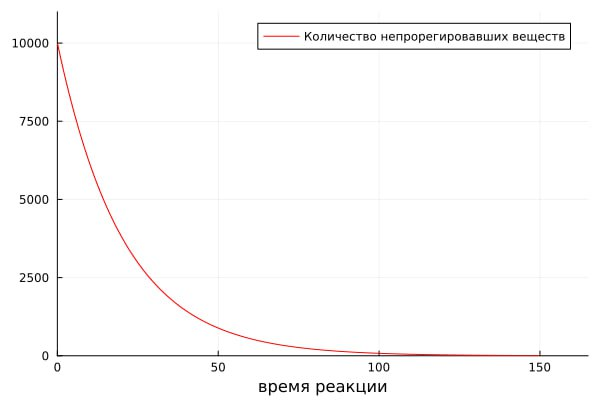
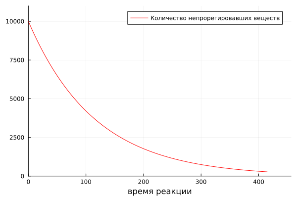
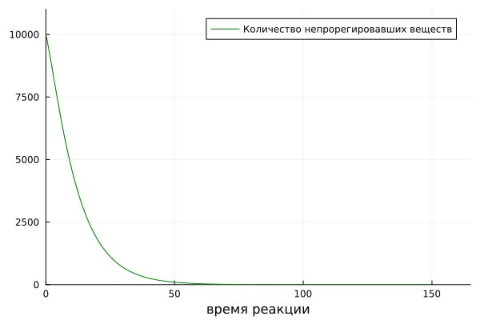

---
## Front matter
lang: ru-RU
title: "Химические реакции, стохастическое горение"
subtitle: "Этап №4"
author: 
  - Саргсян А. Г. 
  - Тасыбаева Н. С.
  - Алхатиб Осама 
  - Саинт-Амур Исмаэль 
  - Тазаева А. А. 
  - Юсупов Ш. Ф. 
institute:
  - Российский университет дружбы народов, Москва, Россия
date: 2023 год

## Formatting
mainfont: PT Serif
romanfont: PT Serif
sansfont: PT Sans
monofont: PT Mono
toc: false
slide_level: 2
theme: metropolis
header-includes:
 - \metroset{progressbar=frametitle,sectionpage=progressbar,numbering=fraction}
 - '\makeatletter'
 - '\beamer@ignorenonframefalse'
 - '\makeatother'
aspectratio: 169
section-titles: true

---
# Задачи проекта 
## Цели и задачи
Цель проекта: на основе построения ансамбля частиц, в которых
возможна мономолекулярная экзотермическая реакция, изучить принципы математического моделирования.

## Цели и задачи 

Задачи проекта:

1.	Провести анализ проектной деятельности и её результатов;
2.	Обсудить трудности, с которыми столкнулись во время выполнения проекта;
3.	Выразить коллективное мнение относительно проведённой работы;
4.	Сформулировать общие выводы проделанной работы;

# Реакция при нулевой теплопроводности вещества

## Алгоритм решения

$${dN\over{dt}}={-N\over{τ}}*exp({{-E_a}\over{kT_0}})=-uN$$

## Результаты реакции 
{#fig:001 width=60%}

## Результаты реакции 
{#fig:002 width=60%}

# Реакции при бесконечной теплопроводности вещества

## Алгоритм решения

$$
\begin{cases}
{dN\over{dt}}={-N\over{τ}}*exp({{-E_a}\over{kT_0}})
\\
{dT\over{dt}}={-q\over{N_0c}}*{dN\over{dt}}
\end{cases}
$$

## Результаты реакции 
{#fig:003 width=60%}

## Результаты реакции 

{#fig:004 width=60%}

## Изменение температуры  

{#fig:005 width=60%}

## Выводы

На данном  проекте мы изучили мономолекулярные экзотермические реакции и их виды, смоделировали алгоритмы при случаях нулевой и бесконечной теплопровдности вещества, изучили скорость изменения температуры вещества во втором случае и его влияние на протекании реакции, пришли к мнению, что увеличение температуры уменьшает время протекания реакции.
